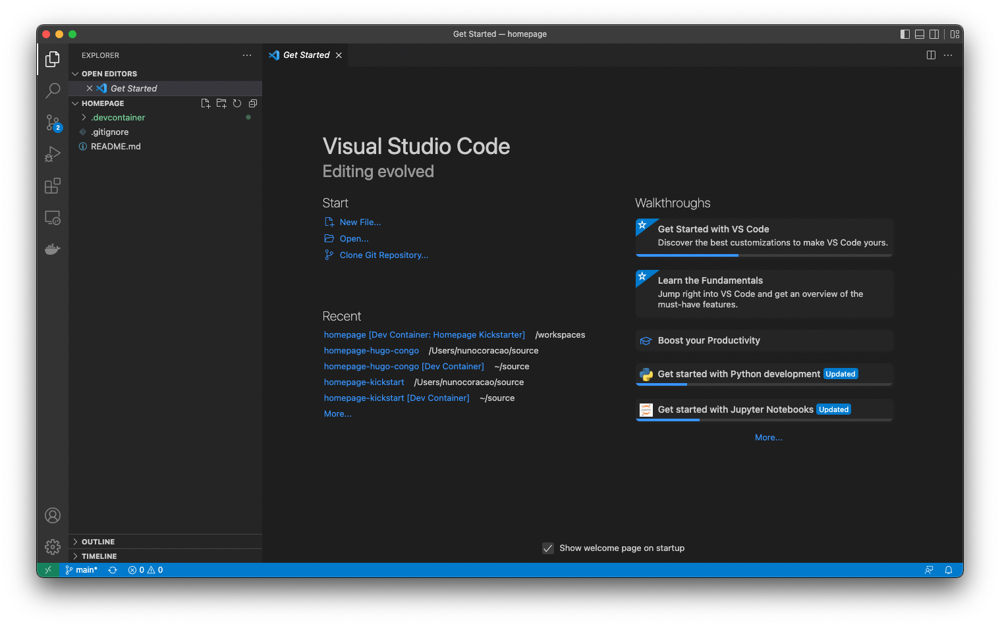
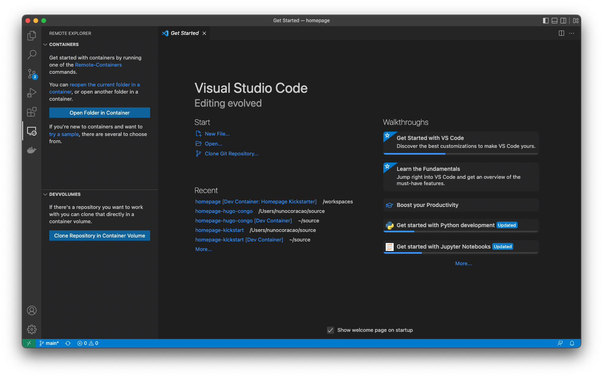
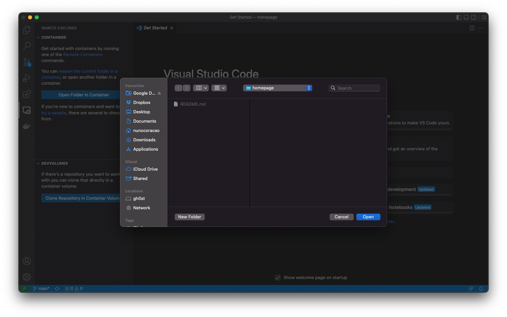
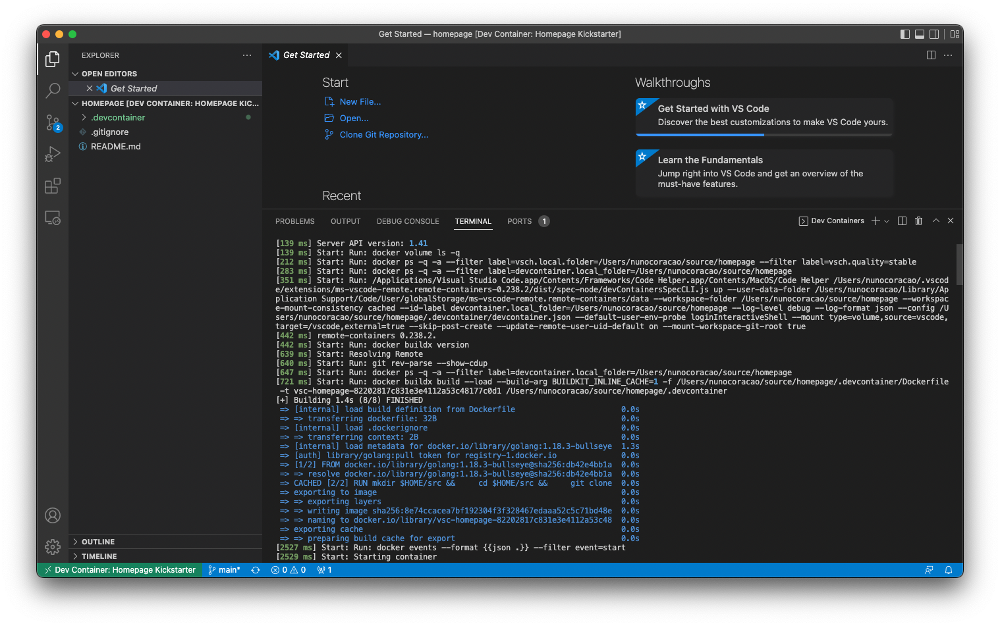
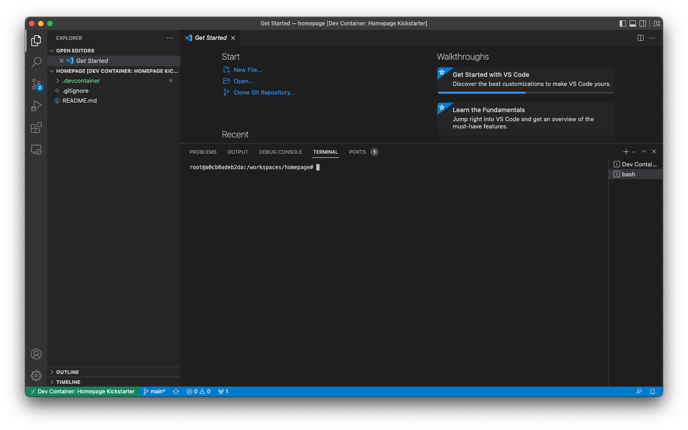
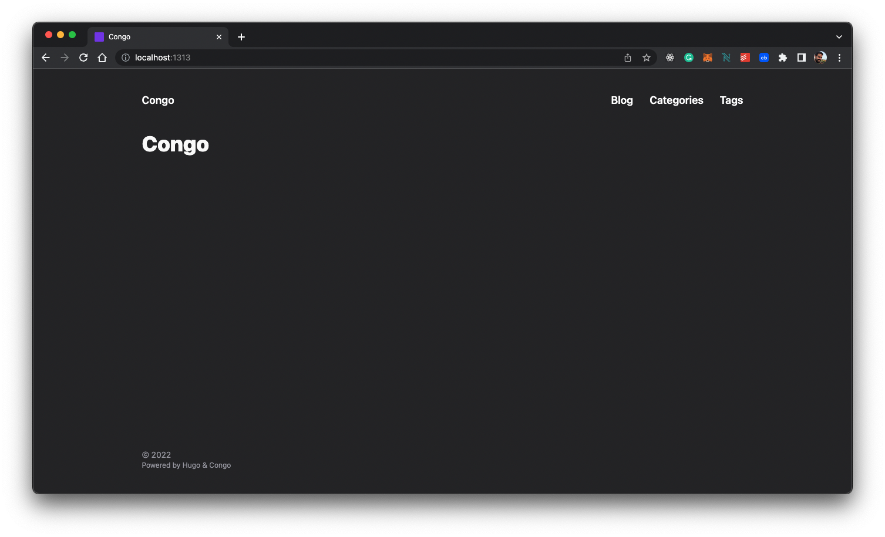

## TL;DR

A couple of months ago I decide to start my personal website. I had two main goals with this 1) I wanted to challenge myself to find out if I could still put something together that sort of works, and 2) I want to start writing more essays which need a place to live online.

After some research I landed on building something using Hugo as the site framework, and firebase as the hosting platform. Hugo seemed to fit all my needs and has a variety of configurations and themes available, oh and it's build in go which is cool these days. Firebase is the best option for me because it allows me to host something for free.

framework
https://gohugo.io

theme
https://github.com/jpanther/congo

## Pre reqs

### Install Docker

Install Docker [link](https://www.docker.com/get-started/)


### Install Visual Studio Code

Install VSCode [link](https://code.visualstudio.com/)


### Install Remote - Containers Extension

Install VSCode Extension called "Remote - Containers"


## Setup local environment

to begin the tutorial clone https://github.com/nunocoracao/homepage-kickstart

```
git clone https://github.com/nunocoracao/homepage-kickstart
```

Open folder in VSCode




Open the "Remote - Containers" extension on the left panel and select "Open folder in container"



Select the current folder



Wait for the image for your development environment to build and start running



once it is running please start a new terminal




## Install Theme

When your enviroment is running it's time to configure Hugo and install a theme, I'm going to use <a target="_blank" url="https://github.com/jpanther/congo">Congo</a> for this guide but feel free to explore other themes in Hugo main page and play around with one that best fits your needs.

Let's start by creating a Hugo site by running the following command:

```script
hugo new site . --force
```

Now let's install the congo theme using git submodules.

```
git submodule add -b stable https://github.com/jpanther/congo.git themes/congo
```

Please run the following commands in order, in order to setup Congo's main confif folder and project structure. 

```
mkdir config 
mkdir config/_default
rm config.toml
cp themes/congo/config/_default/*.toml config/_default/
echo 'theme = "congo"' | cat - config/_default/config.toml > temp && mv temp config/_default/config.toml
```

Let's try it out by running Hugo's debug server:

```
hugo server -D
```

Please open your favourite browser and navigate to <code>localhost:1313</code> to test Hugo running with Congo an empty version of your website.




## Configure Theme

Congo theme documentation - https://jpanther.github.io/congo/docs/

### Profile picture

create assets folder in root

```
mkdir assets
```
choose a profile picture and place it inside the assets folder, the rest of the guide will assume the final picture is named "profile.jpg". If you still need to take a proper awesome picture feel free to download the one below to proceed with the tutorial.


### config.toml

Uncomment the <code>baseURL</code> parameter and replace it with the final domain of your website. This value will be used to create the robots.txt file for any search engines to successfully crawl and index your website.


### languages.en.toml

This file will drive the main information for the website and the author of the page (you). You can replace the <code>title</code> and <code>description</code> for the ones you want for your page, these values will drive the HTML title and description tags. 

Under the tage <code>[author]</code> you can update the details that you wish to highlight in your profile. The bare minimum would be <code>name</code>, <code>image</code>, <code>headline</code>, and <code>links</code>. For the links parameters don't forget to uncomment the last line of the file as this is a json array. In my files I have uncommented the lines I wanted to use and left the others in the file if I want to play around with them in the future.


### params.toml

This file defines much of the overall behaviour across the entire framework. For this tutorial I changed some of the overall values and one for the homepage, if you want to learn more about the other available configurations please consult (Congo's documentation)[https://jpanther.github.io/congo/docs/] documentation. I've changed <code>colorScheme</code> to "ocean" which changes the global UI theme. Activated <code>showAppearanceSwitcher</code> to enable the light/dark mode toggle. Activated <code>enableSearch</code> which indexes all future posts each time you build the site and provides a simple search feature. And finally,changed the value of <code>layout</code>, inside <code>[homepage]</code>, to "profile". Another interesting value here is <code>showRecent</code>, which when turned on shows the recent posts on the homepage.


### final

Run

```
hugo server -D
```

navigate to <code>localhost:1313</code>, this is what you should see


```
git clone https://github.com/nunocoracao/homepage-hugo-congo
```

## How to post

https://jpanther.github.io/congo/docs/content-examples/

Run the following command to create you first post

```
hugo new posts/my-first-post.md
```

replace the contents of the file with the following:
```
---
title: "My Published Post"
date: 2022-06-19T20:10:29Z
draft: false
categories: ["published", "test"]
tags: ["first", "awesome"]
---

This is my first blog post
```

This just created your first blog post. We've added a couple of categories and tags, which will be indexed by Hugo during build time. These tags will be used to create the Categories and Tags section of the website automatically for you. Notice that I've changed the <code>draft</code> to false to simulate a published post.

Run the following command to create you second post

```
hugo new posts/my-draft-post.md
```
and replace the contents of that file with the following:

```markdown
---
title: "My Draft Post"
date: 2022-06-19T20:20:39Z
draft: true
categories: ["draft", "test"]
tags: ["second", "awesome"]
---

This is my second blog post
```
For the second post, I've left the <code>draft</code> parameter true to simulate a draft post.

Hugo automatically hides draft posts from the final site generation. You can keep working on articles leaving the draft label true and they will be ignored by the engine. If you want to run in DEBUG mode just use the command:

```
hugo server -D
```

If you go to the posts are in the site you should be able to see both entries. If you then run the server in normal mode the draft articles will dissapear. You can use the command below to do so:


```
hugo server
```

You can use this command to test the final version of the website or an article before generating the final build. When you're ready just use the command 'hugo' to generate the final website inside the /public folder.

```
hugo
```

## Deploy


### Create Firebase Project

 

 


### Setup Firebase

```
firebase deploy
```

 

```
firebase init
```

 

choose the project configured in the previous step

 


### Deploy

```
firebase deploy
```

 

open url 

