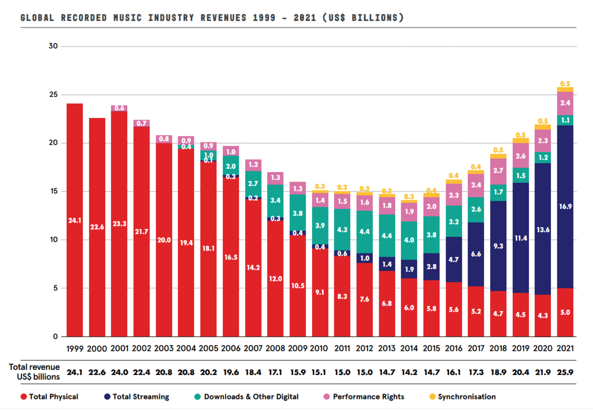
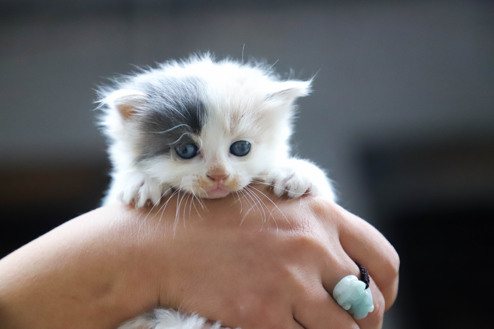
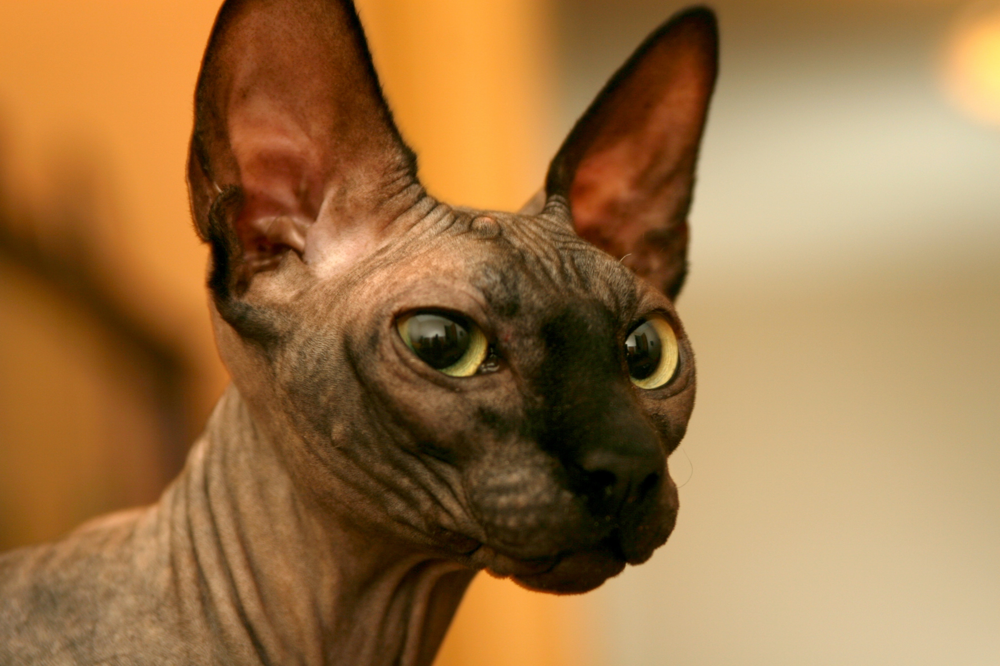

Technology has disrupted the music industry several times in history, changing the way we consume it, how it’s distributed and even how it’s made. With the introduction of radio, vinyl records and then portable audio players, our relationship with music has become part of everyday life, much more intimate and diverse, creating a multi billion dollar industry that’s constantly reinventing itself to extract the maximum potential from artists and meet our demands as consumers.

In the past couple of years there’s been a great debate around the applicability of non-fungible tokens (NFTs), and the music industry is currently the stage for lots of experimentation with popular artists like [Snoop Dogg](https://www.complex.com/music/snoop-dogg-nft-plans-death-row-records), [Steve Aoki](https://decrypt.co/91317/dj-steve-aoki-launches-ethereum-nft-membership-club-i-am-building-my-own-world) and [Mike Shinoda](https://www.kerrang.com/mike-shinoda-has-released-the-music-from-his-45-second-nft-mixtape) making bold moves in the space. In this article we’ll reflect about the good, the bad, and the ugly facts around NFTs in the music industry.

## Status Quo

For decades, the music industry was controlled by publishers and studios which would act as gatekeepers to what got recorded and distributed. During that period, recording music was an expensive process that required upfront investment. On the other end, the marketing and distribution machine ensured that whatever got recorded was sold. Artists that were not able to get publishing deals had nearly zero chances of entering the market.

That all changed with technology, recording is now so cheap that you can do it on almost any laptop, distributing to the major streaming platforms is cheap and accessible, and marketing can be achieved through social networks ([TikTok](https://www.businessinsider.com/how-tiktok-is-changing-the-music-industry-marketing-discovery-2021-7), for example is one of the most common marketing vehicles). Even with all these shifts, the music industry is still largely controlled by the major publishers because of the huge machine behind, that markets, promotes, and distributes new music, concerts, social accounts, etc.

Streaming has been the dominant distribution format for some years now. In 2021, around [65% of global recorded music revenues](https://www.ifpi.org/wp-content/uploads/2022/04/IFPI_Global_Music_Report_2022-State_of_the_Industry.pdf), with Spotify alone accounting for almost [half a billion users](https://variety.com/2022/digital/news/spotify-q3-results-456-million-total-users-1235414241/) and almost 200 million paying subscribers.

For the large majority of content, digital platforms negotiate streaming rights with major record labels. Sony BMG, Warner, and Universal together hold the rights for [around 67.5%](https://musicandcopyright.wordpress.com/2022/04/05/sme-and-wmg-the-biggest-market-share-winners-in-2021/) of the global recorded music market, which shows us how much power and influence these companies exert in the industry. Artists are at the end of the value chain creating content, performing live, and [securing the last slice of the pizza](https://output.com/blog/how-much-musicians-actually-earn). While this is the status quo for most, technology improvements have been consistently enabling artists to explore DIY alternative ways to build a music career and make a decent living from their work. In recent years, NFTs have captured the attention of many, who ventured in the path of independent music making.

But taking a step back, what is actually an NFT? Originally proposed and built as an Ethereum smart contract, [non-fungible tokens](https://ethereum.org/en/nft/) are a specification to represent ownership and trading of unique assets. Technology-wise, the NFT itself is a simple collection of digital documents that can be stored and consumed using normal computers and smartphones. What’s more interesting about them is the fact that they’re built on top of distributed ledgers, that make it very hard/expensive to tamper with, allowing for a trustless and transparent economy where users are able to trade directly with each other, and the whole transaction record stays public for anyone to audit and verify the ownership of any given NFT.  

## The Good

### Royalties

There’s a great number of hops in the [value chain](https://music.dataobservatory.eu/post/2022-02-15-music-value-chain/) between artists and their fans. The machine that makes it possible for commercial music to play on our earphones is a complex one, with a lot of different entities profiting in between. Streaming services have been heavily criticized for [low payouts](https://www.forbes.com/sites/marisadellatto/2022/03/24/spotify-says-it-paid-7-billion-in-royalties-in-2021-amid-claims-of-low-pay-from-artists/?sh=6c5fc06da0db), and record labels were always known for [monopolizing rights](https://nickledanddimed.com/2022/05/24/record-labels-the-third-party-monopolies-in-the-music-industry/) with unfair contracts that force artists to give up ownership of their songs to the label.

What NFTs and the crypto asset economy are creating is the possibility to bypass some hops, naturally changing the way business is made. While most of what we see is still experimentation, [maintaining rights ownership](https://rockcelebrities.net/mike-shinoda-explains-the-commercial-rights-rule-for-his-nfts/) is what seems to be the main discussion topic.  

On top of selling their content almost directly to fans, NFT transactions make it possible to automate royalty enforcement mechanisms for artists to earn creator shares on the secondary market. NFT platforms like [Open Sea](https://support.opensea.io/hc/en-us/articles/1500009575482-How-do-creator-fees-work-on-OpenSea-), [Rarible](https://rarible.com/), [Sound.xyz](https://www.sound.xyz/), and [Catalog](https://beta.catalog.works/) already include royalties as part of their functionality, but the biggest game changer is that these royalties could actually be enforced by the blockchain protocol itself, further protecting the artists from not receiving a fee when their music is re-sold. On top of this, licensing also becomes more efficient as such a public registry can help avoid disputes and overlapping royalty claims. 

### Alternative Ways of Monetization

NFTs make it possible to skip the middleman, and enable a different business model where artists can sell content by themselves. There’s not yet a standard recipe for “what” is actually sold with the NFT, which is why artists are experimenting with different combinations. Electronic dance music star 3LAU was among the first to venture in the NFT space and [made a small fortune](https://www.forbes.com/sites/abrambrown/2021/03/03/3lau-nft-nonfungible-tokens-justin-blau) with an NFT sale to mark the third anniversary of his album Ultraviolet. Content included several exclusive items like a custom song, access to never-before-heard music online, custom art based on the music and new versions of Ultraviolet’s 11 original songs.. Another popular NFT sale was carried out by [Grimes](https://www.rollingstone.com/music/music-news/grimes-nft-digital-artwork-1134516/) who launched a collection of digital art accompanied by exclusive music. More conservative approaches are also showing up, and in this case, [Kings of Leon](https://www.rollingstone.com/pro/news/kings-of-leon-when-you-see-yourself-album-nft-crypto-1135192/) were one of the first to add NFTs to the list of already available distribution channels like Spotify and iTunes, along with some special perks for NFT holders.

Another interesting thing is again rights, but from the transferability perspective. With no record label contract in place, it is up to the artists to decide whether to protect their contents by keeping the rights to themselves or give them away to NFT holders. There was a popular [discussion on twitter](https://rockcelebrities.net/mike-shinoda-explains-the-commercial-rights-rule-for-his-nfts/) between Mike Shinoda and one of his fans, where the artist was very clear about non commercial use when asked if `Ziggurat` could be reproduced in social media posts. On the other hand, should artists choose to embed copyrights in the NFT, it would open the rights market to the general public looking out for potential investments and portfolio diversification, making it more valuable in the short term. 

### Scarcity and New Ways to Interact With the Fans

The element of scarcity is known to generate lucrative profits on pretty much everything that can be sold. Paintings and limited product editions are common examples of scarcity augmenting the price of a given asset. The music industry is no stranger to this marketing technique, and the unique nature of NFTs make them the perfect vehicle for artists to appeal to scarcity in new ways, since they are the ones controlling the number of copies in circulation. One example would be Shawn Mendes’ launching his [NFT collection](https://opensea.io/collection/genies), which includes rare digital versions of his signature accessories such as his Fender guitar and gold ring. While such assets can easily be copied and illegally reproduced, the proof of ownership made possible by NFTs also acts as a guarantee of authenticity, and can be used to build experiences like backstage access, digital collectibles and other exclusive assets for the most dedicated fans. This is what the platform [aok1verse](https://a0k1verse.xyz/) (Steve Aoki’s take on NFTs and Metaverse) tries to create by granting exclusive perks to the fans like access to merchandise, real life events, early access to unreleased music and even artistic collaboration. 

## The Bad

NFTs and blockchain promise a more fair and equal future in many industries, but at the moment the underlying technology is still pretty immature, and we don’t know in which terms it will stick around. If something changes and all of a sudden Ethereum stops being the dominant NFT platform, users might move away to a different technology and it remains unclear what happens to all of those who already invested in NFTs. 

There’s a lack of standardization and interoperability which is bringing in new NFT specifications and blockchains. As the ecosystem continues to evolve, we’re likely to see different, incompatible platforms coming to life, potentially leading to an excessive amount of distribution channels for artists to worry about.

The usability is also not there yet, and most of these technologies are not accessible to everyone, leaving the less proficient outside, while at the same time creating an opportunity for new middlemen companies that pretty much like producers and distributors will generate profit from the artist’s success.

On top of all of this there is the crypto asset market, which is in its early days and is frequently the central stage for price speculation, volatility and fraud. Most of the above problems are mainly related with a general lack of regulation on the market itself which naturally has an impact on how the NFT asset class is perceived.

## The Ugly

Even with all the above changes, the music industry at its core still has the biggest piece of the pie. Publishers and distributors are still the gatekeepers of success for most artists. Even the ones that found success through social networks still end up getting signed by a major publisher in order to scale their brand and get their music to as many listeners as possible.

Some of the previously discussed experiments with NFTs are being driven by players in the music industry not by newcomers to the space. Thus, we are yet to understand if NFTs will be just another tool in the publishers’ belt to maximize profits versus something else that can be leveraged at scale by new unsigned artists. 

Finally, most attempts and experiments seem like marketing stunts to leverage the hype of crypto. This has the potential to undermine the future value of NFTs for music both technically and economically.

## Wrap Up

The whole crypto asset industry is still at its early days and essentially lacks definition and standardization, which can be both good and bad for its role in the music industry. On one hand it created a space for the brave, defiant ones to experiment new approaches to their careers, but on the other the infrastructure is not built yet, which restricts NFTs to the tech savvy users and creates the space for new middlemen.
We should also be mindful that the current price speculation and fraud with NFTs and crypto assets in general doesn’t allow a clear forecast of what will be the monetary value for music NFTs, and neither if it will be possible to make a living out of them.

What stays on the record for now is that by democratizing the commercial trades of digital assets, NFTs have definitely captured some attention in the music industry, helping out artists to have a more independent career and sell their music directly to the fans. Major companies in the industry have also noticed this and will eventually start chipping in as the whole ecosystem is yet to be properly regulated. The latter also poses an interesting question that goes straight to the core of what NFTs and blockchain stand for: if there is a centralization of the system, in this case major studios/publishers controlling most of these technologies, does the community really benefit from decentralized technology?

Even though NFTs have huge potential for the music industry and art in general, we think that the biggest unfair advantage will probably remain the same as it always has been: the ability to make something stand out of the crowd. And this is where the major studios and publishers win because of their amazingly oiled machine that can pick up almost anything and market/distribute it to a global audience, with or without NFTs.
